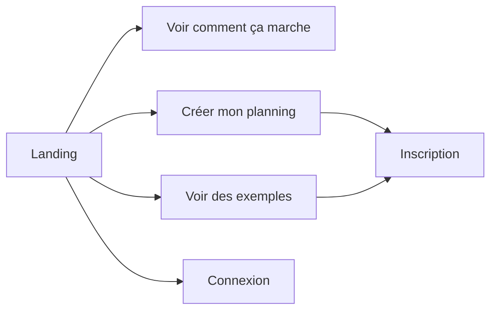
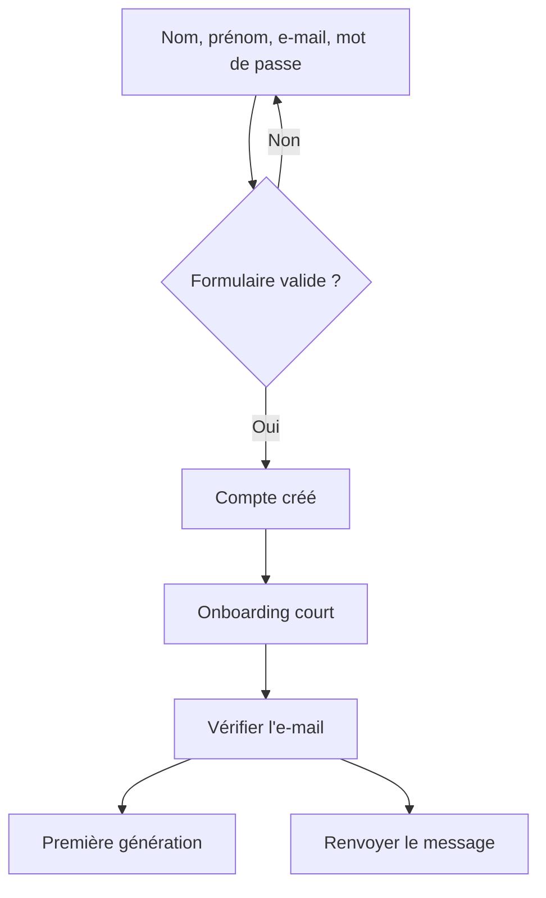
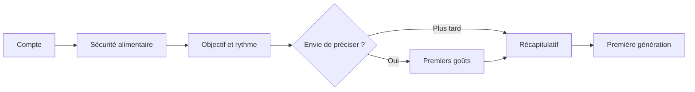
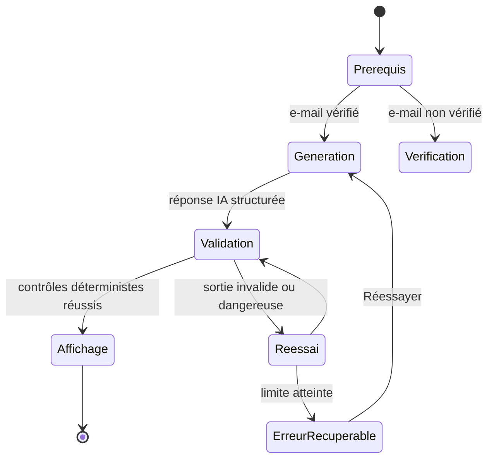
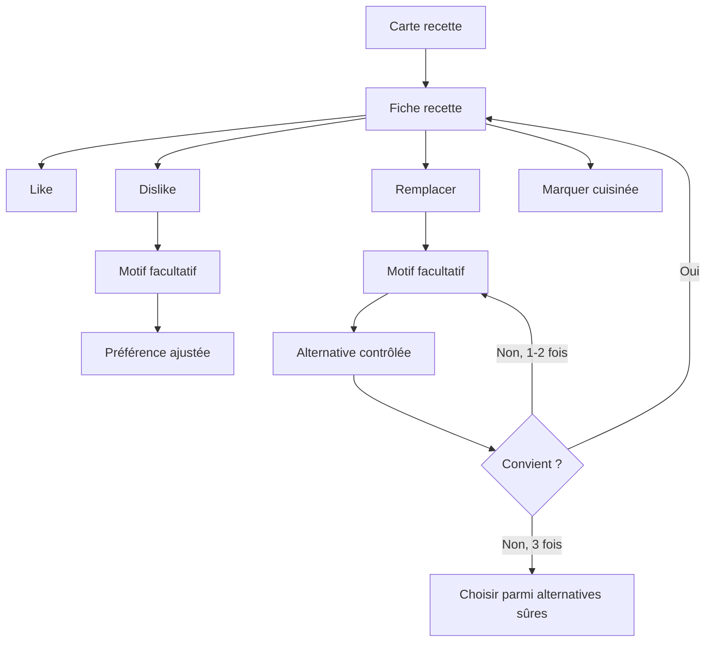
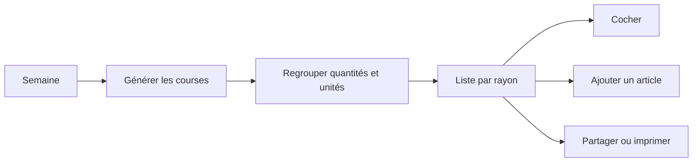
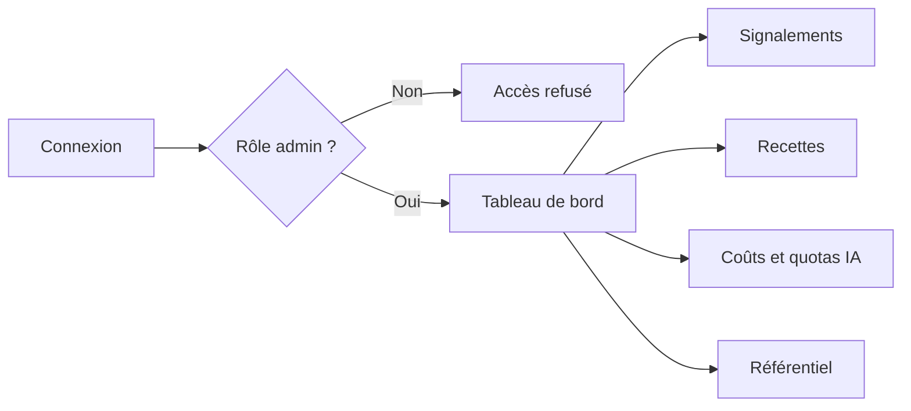

# Parcours utilisateurs du MVP web

Statut : wireflows de conception, à valider par tests utilisateurs.  
Périmètre : application web responsive; aucune application mobile native.

## Principes communs

- montrer une valeur avant de demander beaucoup d'informations ;
- onboarding initial limité au strict nécessaire, préférences enrichies ensuite
  ;
- sauvegarder chaque étape et permettre de reprendre ;
- toujours proposer une sortie ou une action de récupération ;
- ne jamais masquer une allergie derrière un simple réglage de goût ;
- expliquer qu'une image IA est illustrative.

## 1. Visiteur

La landing présente la promesse, trois étapes, des recettes de démonstration et
la transparence IA. Aucune préférence n'est enregistrée sans compte.

États particuliers :

- service indisponible : exemples statiques et message de reprise ;
- utilisateur déjà connecté : redirection vers son accueil ;
- lien protégé demandé : retour vers la destination après connexion.

## 2. Inscription et vérification

Les erreurs sont placées au niveau du champ et résumées en tête de formulaire.
Un e-mail déjà utilisé conduit vers la connexion ou la récupération du mot de
passe sans révéler l'existence d'un compte à un tiers.

## 3. Onboarding court et profil progressif

### Socle initial

1. compte et date de naissance ;
2. allergies, intolérances et exclusions strictes ;
3. objectif alimentaire, repas par semaine et portions ;
4. quelques choix visuels de plats, facultatifs.

Chaque étape est sauvegardée. « Plus tard » est disponible pour les goûts, mais
jamais pour la confirmation explicite des exclusions alimentaires.

### Profil progressif

Après la première semaine, l'application pose au plus une question contextuelle
: temps de cuisine, équipement, budget, cuisines appréciées ou motif d'un swap.
L'utilisateur peut fermer la question et la désactiver.

## 4. Première génération

Pendant l'attente, afficher les étapes réelles sans fausse progression : «
préparation », « contrôle des contraintes », « finalisation ». Une interruption
conserve le travail serveur et permet de reprendre.

## 5. Accueil et planning hebdomadaire

L'accueil montre :

- la semaine courante et le prochain repas ;
- les cartes de recettes de l'utilisateur ;
- la progression de préparation ou une action de génération ;
- un accès direct aux courses, favoris et profil.

Le planning permet de naviguer entre jours, de voir le statut d'un repas et
d'ouvrir la recette. Les changements de semaine conservent les interactions déjà
réalisées.

## 6. Recette, like, dislike et swap

Un like est réversible. Un dislike sans motif reste un signal faible. Un swap ne
modifie le planning qu'après validation de l'alternative. En cas d'échec, la
recette initiale reste accessible.

## 7. Liste de courses

Une modification du planning propose de recalculer la liste sans perdre les
éléments manuels ni l'état coché.

## 8. Favoris

Les favoris sont accessibles par recherche et filtres simples. Ouvrir une
recette permet de la consulter ou de la réutiliser dans une semaine ultérieure.
Un état vide explique comment ajouter un favori.

## 9. Profil et préférences

Sections séparées :

- compte et sécurité ;
- foyer, portions et rythme ;
- allergies/intolérances/exclusions avec avertissement renforcé ;
- goûts et cuisines ;
- objectif alimentaire ;
- confidentialité, export et suppression.

Une modification de sécurité alimentaire explique son effet sur les futurs plans
et propose de contrôler le planning courant.

## 10. Administration

Les données personnelles sont masquées par défaut. Les actions sensibles sont
journalisées et demandent une confirmation. L'administration n'est jamais
accessible par la seule dissimulation d'un lien.

## Matrice des erreurs et reprises

| Situation                   | Message                                     | Action principale            | Conservation                     |
| --------------------------- | ------------------------------------------- | ---------------------------- | -------------------------------- |
| Hors ligne                  | Connexion indisponible                      | Réessayer                    | Formulaire local non sensible    |
| Session expirée             | Reconnexion nécessaire                      | Se reconnecter               | Destination et brouillon sûr     |
| Génération longue           | Préparation toujours en cours               | Continuer en arrière-plan    | Job serveur                      |
| Fournisseur IA indisponible | Impossible de finaliser                     | Réessayer plus tard          | Plan précédent                   |
| Sortie rejetée              | Une proposition n'a pas passé nos contrôles | Nouvelle tentative sûre      | Contraintes                      |
| Quota atteint               | Limite temporaire atteinte                  | Voir alternatives existantes | Planning                         |
| Swap échoué                 | Recette initiale conservée                  | Choisir une alternative      | Recette initiale                 |
| Sauvegarde impossible       | Modification non enregistrée                | Réessayer                    | Saisie courante                  |
| Accès interdit              | Action non autorisée                        | Retour à l'accueil           | Aucun changement                 |
| Suppression de compte       | Confirmation forte requise                  | Confirmer/annuler            | Compte intact avant confirmation |

## Hypothèses à tester

- quatre étapes semblent assez courtes si les goûts restent facultatifs ;
- cinq choix visuels suffisent pour une première personnalisation ;
- les utilisateurs comprennent la différence entre exclusion et dislike ;
- le marqueur « cuisiné » est suffisamment visible ;
- demander un motif après deux swaps n'est pas perçu comme bloquant ;
- une navigation principale à cinq entrées reste compréhensible.
